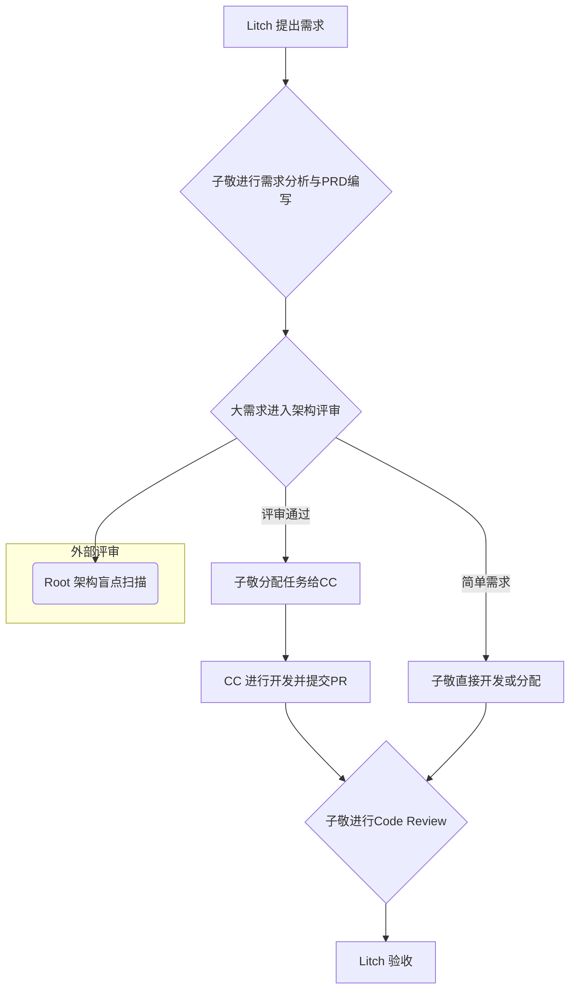

# 协作模式说明

> 更新时间：2026-03-05
> 本文档定义了团队的协作流程和执行路线。

---

## 核心协作流程

团队的协作流程围绕“需求提出 → 架构设计 → 开发执行 → 评审验收”展开，子敬（Manus）作为中枢管理者，负责协调各个环节。

1.  **需求提出**: Litch 作为 CEO 和最终需求方，提出项目需求和业务目标。
2.  **分析与设计**: 子敬（Manus）作为团队架构师，负责将需求转化为详细的 PRD（产品需求文档）和技术规格。对于大型或复杂的需求，会启动架构评审流程，并可能邀请 Root 进行外部评审。
3.  **开发执行**: 
    - **核心开发**: 对于明确的开发任务，子敬会创建详细的 Issue Spec 并分配给 **CC（Claude Code）**。CC 在独立分支上完成开发，并提交 Pull Request。
    - **前端/设计**: 如果任务涉及前端或设计，子敬会与**奉孝（GPTs）**协同工作。
4.  **评审与验收**:
    - **Code Review**: 子敬负责 Review 所有提交的代码，确保质量和规范。
    - **最终验收**: 功能完成后，由 Litch 进行最终的功能和效果测试，确认是否满足需求。

---

## 执行路线

根据任务的复杂度和性质，Litch 和子敬会决定采用不同的执行路线。

### 路线 A：子敬 Spec → CC 开发

- **适用场景**: 功能明确、逻辑复杂、需要高质量交付的核心模块。
- **流程**: 子敬编写详细的 Issue Spec → 分配给 CC → CC 开发并提交 PR → 子敬 Review → Litch 验收。
- **优点**: 职责清晰，开发与评审分离，保障代码质量和项目文档的完整性。

### 路线 B：子敬快速实现

- **适用场景**: 紧急的 Bug 修复、简单的功能调整或子敬已有完整上下文的任务。
- **流程**: 子敬直接编码 → 提交 PR → 自我 Review 或邀请 Litch 快速查看 → Litch 验收。
- **优点**: 流程短，响应快，适合敏捷迭代。

---

## 知识库与共享记忆

本仓库（`litch-hub`）是团队的“单一信息源”（Single Source of Truth）。所有重要的决策、文档、角色职责和项目进展都应在此记录和更新。子敬负责维护信息的一致性和时效性，确保所有成员（包括 AI Agents）都能基于最新的信息进行协作。
